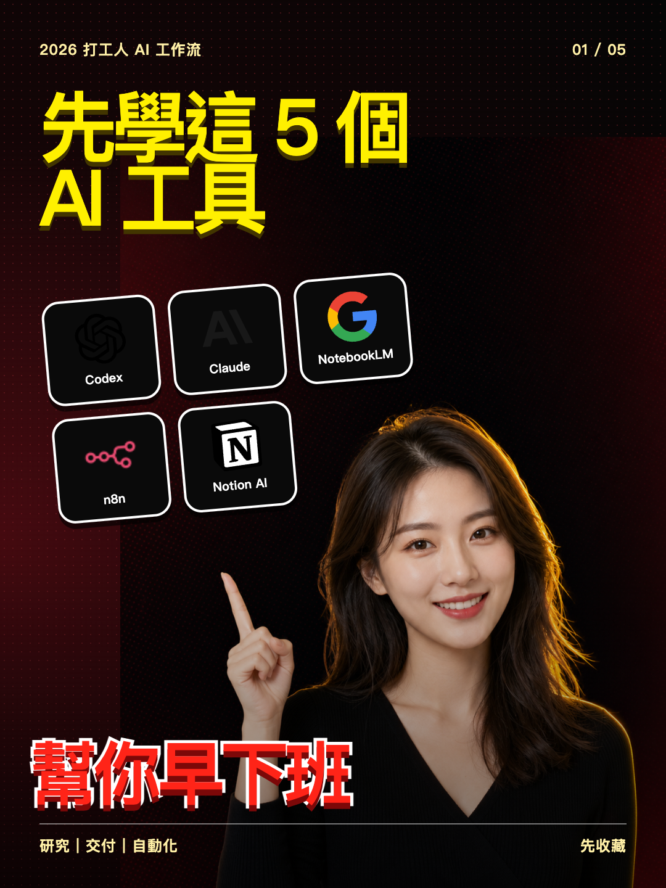
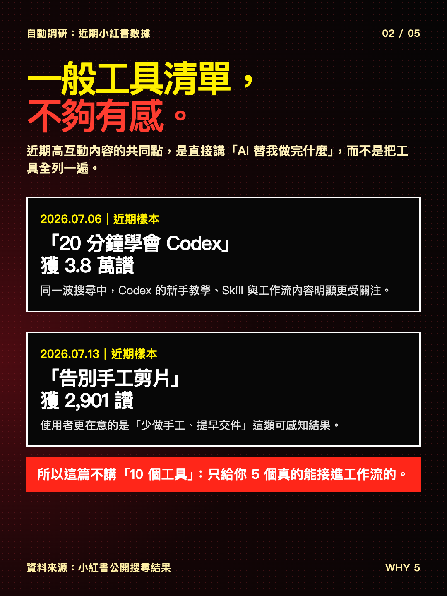
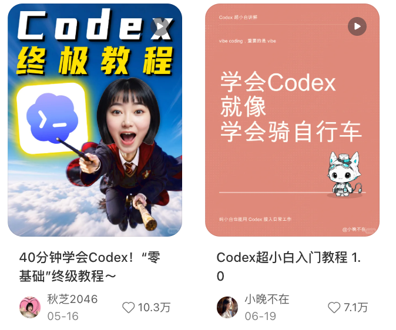
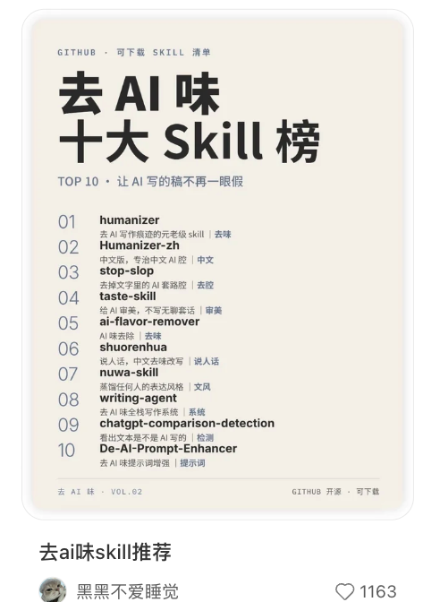
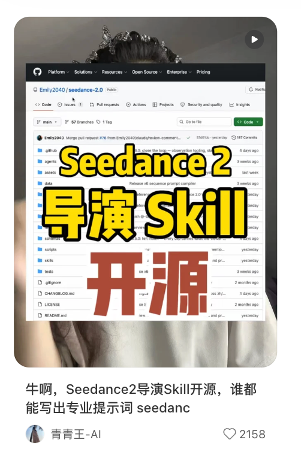

<h1 align="center">qiqixiaohongshu-carousel</h1>

<p align="center"><strong>一句話，生成符合爆款邏輯的精美小紅書圖文。</strong></p>

<p align="center">
  先研究近期高互動筆記，再優化切入角度、標題與封面，最後用 Image2.0 直接交付成品。
</p>

<p align="center">
  
  
  
  
</p>

<p align="center">
  
  &nbsp;&nbsp;
  
</p>

## 它不是普通排版工具

大多數 AI 圖文工具拿到主題後就直接寫、直接排，所以很容易變成「看起來整齊，但沒有點擊理由」的 PPT 式內容。

`qiqixiaohongshu-carousel` 會先研究近期小紅書高互動筆記，找出值得借鑑的選題角度、標題鉤子和封面規律，再把你的知識包裝成更適合平台傳播的圖文。

| 普通 AI 圖文 | qiqixiaohongshu-carousel |
| --- | --- |
| 拿到主題直接生成 | 先調研近期高互動筆記 |
| 給一個普通標題 | 提供 5 個爆款切入角度 |
| 套模板、像簡報 | 先讀真實封面，再設計視覺 |
| 只交文案或提示詞 | 用 Image2.0 交付完整圖片 |
| 你自己找資料和案例 | 提供對標連結、時間與互動數據 |

目標是把原本分散的調研、選題、拆頁與排版工作集中到一次對話，依內容複雜度不同，每次可望省下約 1–2 小時。

## 快速安裝

### 最簡單：直接把這句話貼給 Codex

```text
請使用 $skill-installer 安裝這個 Skill：
https://github.com/aiwithlanny/qiqixiaohongshu-carousel
```

安裝後重新啟動 Codex，讓它載入新的 Skill。

### 手動安裝

```bash
git clone https://github.com/aiwithlanny/qiqixiaohongshu-carousel.git ~/.codex/skills/qiqixiaohongshu-carousel
```

使用前請確認 Codex 可以調用 `agent-reach` 進行爆款調研，並且可以使用 `imagegen` 的 Image2.0 生圖。

## 一句話開始使用

```text
幫我做小紅書圖文。
主題：2026 年職場人必備的 10 個 AI 工具
圖片頁數：5 張
喜歡的風格：留空，請根據爆款調研決定
```

你也可以直接說：

```text
使用 qiqixiaohongshu-carousel，把這份文案優化成 6 張小紅書圖文。
先研究近期爆款標題與封面，再幫我確認標題、排版和主視覺，最後用 Image2.0 生圖。
```

## 實際效果

以下圖片都是這套工作流實際產出的 Image2.0 成品，不是網頁模板或 PPT 截圖。

<p align="center">
  
  
  
  
</p>

### 同一主題，生成不同點擊角度

**案例 1：AI 一人公司最值得做的 5 個賽道**

同一個主題，分別使用「高密度清單」、「高手秘密」和「真人科普」三種封面公式。人物 IP 保持一致，但標題鉤子、視覺重心與配色全部改變。

<p align="center">
  
  
  
</p>

**案例 2：盤點 100 個 AI 工具，這 5 個最值得用**

封面同時放入工具名稱與可辨識 Logo，一張走乾淨收藏型，一張走黑底汰汰對比型，讓相同內容可以測試不同受眾反應。

<p align="center">
  
  
</p>

> 以上 5 張封面均使用同一個自有 IP 形象作為人物參考，再由 Image2.0 重新構圖生成。

## 內建 7 種知識類爆款視覺模板

這些不是固定底圖，而是 Skill 從真實高互動封面中拆出的「標題公式＋資訊層級＋視覺重心」。生圖時會根據主題重新設計，不會複製原作。

> 以下為使用者提供的公開頁面截圖，只用於研究封面結構與傳播邏輯；版權歸原作者所有，不代表合作或本 Skill 產出。

<table>
  <tr>
    <td width="33%" valign="top">
      <br>
      <strong>1. 量化結果型</strong><br>
      「90%」與「1 個 Skill」形成強烈的成本對比，適合省時、省錢、降低 Token 等主題。
    </td>
    <td width="33%" valign="top">
      <br>
      <strong>2. 保姆級教程型</strong><br>
      品牌詞＋新手保證＋步驟路徑，讓讀者一眼知道「這篇能帶我完成安裝」。
    </td>
    <td width="33%" valign="top">
      <br>
      <strong>3. 零基礎終極教程型</strong><br>
      可走強戲劇人物風，也可走留白類比風；核心都是降低新手畏難感。
    </td>
  </tr>
  <tr>
    <td width="33%" valign="top">
      <br>
      <strong>4. 高手秘密型</strong><br>
      「90% 的工作」、「絕不告訴你」製造結果承諾與資訊差，適合進階技巧。
    </td>
    <td width="33%" valign="top">
      <br>
      <strong>5. 高密度清單型</strong><br>
      大標題＋Top 10＋用途摘要，像一張可保存的清單，適合工具榜與 Skill 推薦。
    </td>
    <td width="33%" valign="top">
      <br>
      <strong>6. 新工具／開源發布型</strong><br>
      工具名與「開源」直接放大，搭配 GitHub 或產品畫面，適合新資源首發。
    </td>
  </tr>
  <tr>
    <td width="33%" valign="top">
      <br>
      <strong>7. 問題科普／真人講解型</strong><br>
      「什麼是……？」先承接搜尋需求，再用「普通人如何……」給出實際好處。
    </td>
    <td width="66%" colspan="2" valign="top">
      <strong>同一主題，不只一種包裝</strong><br><br>
      例如「Codex Skill」可以被轉成：<br>
      • 結果型：1 個 Skill 幫你降低 90% Token<br>
      • 新手型：Codex 保姆級 Skill 安裝教程<br>
      • 進階型：Codex 高手不說的 3 個神級 Skill<br>
      • 清單型：Codex 必裝 10 個 Skill 清單<br>
      • 科普型：什麼是 Codex？普通人如何上手<br><br>
      Skill 會先對照真實互動數據，再為你選擇最適合的切入角度，而不是每次都套同一個模板。
    </td>
  </tr>
</table>

### 模板不是拿來照抄

Skill 只借鑑高互動封面的標題結構、資訊層級、對比關係與視覺重心。人物、文案、圖標、配色和版面都會重新設計；如果主題是 Codex、NotebookLM 等高辨識度工具，才會在封面保留正確 Logo 或產品視覺。

## 它怎麼工作

```text
你給主題或文案
      ↓
AgentReach 調研近期爆款筆記
      ↓
提供 5 個選題角度、原始連結與公開數據
      ↓
你提供想對標的封面截圖
      ↓
一起確認主標題、頁數、排版和主視覺
      ↓
從 7 種知識類視覺公式中選擇最適合的模板
      ↓
Image2.0 生成成品並做品質檢查
```

封面截圖由你從對標連結中挑選並提供。這能確保 Skill 真正讀過你想參考的封面，而不是憑空猜測平台風格。

## 兩種工作模式

### 模式 A：你只有一個主題

適合還沒有整理文案的人。Skill 會：

1. 調研近期高互動筆記。
2. 提供 5 個值得參考的選題角度。
3. 根據你選的角度補充資料並寫出圖文大綱。
4. 確認標題、頁數、排版和主視覺。
5. 用 Image2.0 生成完整圖片。

### 模式 B：你已經有文案

適合已經有文章、筆記、課程內容或產品資料的人。Skill 會：

1. 保留你的核心知識與觀點。
2. 研究同主題的爆款標題和封面。
3. 優化切入角度、標題與圖文節奏。
4. 確認排版後直接用 Image2.0 生圖。

## 適合哪些場景

- AI 工具、職場效率與科技知識分享
- 個人品牌、顧問、講師與知識型創作者
- 課程、社群、服務或產品的內容行銷
- 把文章、逐字稿、報告或筆記改成小紅書圖文
- 不想每天花大量時間找選題、拆封面和排版的人

## 你只需要提供三項資料

```text
文案或主題：
圖片頁數：預設 5 張
喜歡的風格：可留空
```

風格留空時，Skill 會根據爆款筆記的標題、封面與重要視覺元素提出設計方案。

## 常見問題

### 它能保證爆款嗎？

不能。沒有任何工具可以保證流量。這個 Skill 的價值是用近期真實樣本降低盲猜，讓選題、標題和封面更符合平台上的有效規律。

### 為什麼要我提供封面截圖？

小紅書頁面經常有登入或載入限制。由你挑選並截圖，可以更快、更準確地確認真正想對標的視覺，而不是讓 AI 假裝看過。

### 會直接交付圖片嗎？

會。確認內容與排版後，成品必須使用 `imagegen` 的 Image2.0 生成，不用 HTML、PPT 或 Canva 截圖冒充。

### 我沒有喜歡的風格怎麼辦？

可以留空。Skill 會根據調研到的爆款封面提出主視覺、顏色和排版方向。

### 更新 Skill 後，GitHub 會自動同步嗎？

不會。本機 Skill 和 GitHub 是兩份獨立檔案。每次迭代後，需要重新將最新版同步到 GitHub；安裝 GitHub 發佈工具後，可以把這一步交給 Codex 自動完成。

## 如果它幫你省下時間

如果這套流程幫你少走彎路、少花時間找對標，歡迎點一下右上角的 **Star**。你的支持會讓這個 Skill 持續更新更多小紅書爆款研究與視覺工作流。

> 好內容不該輸在包裝。讓你的知識，更容易被看見。
